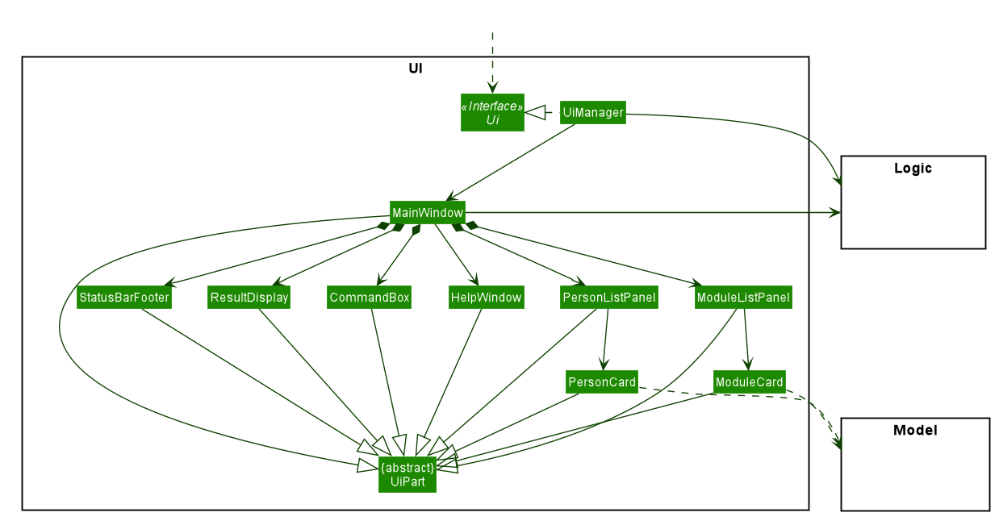
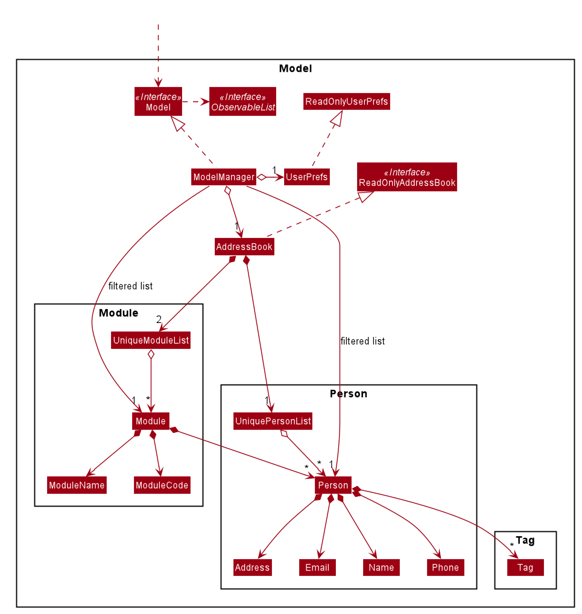
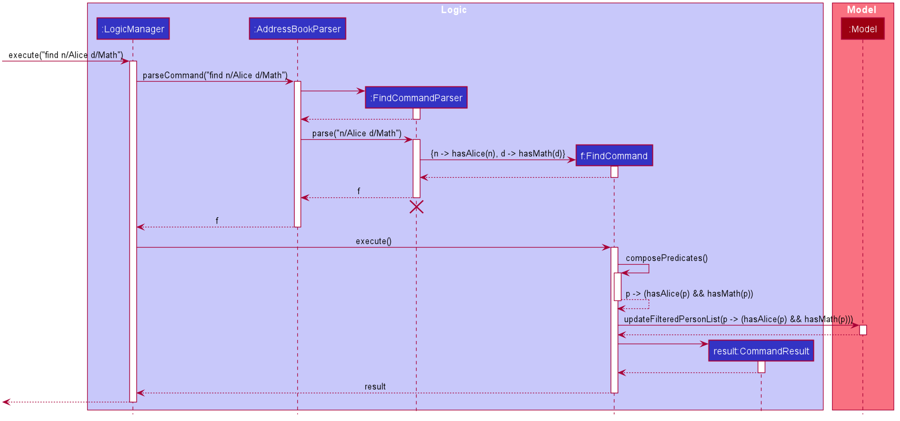
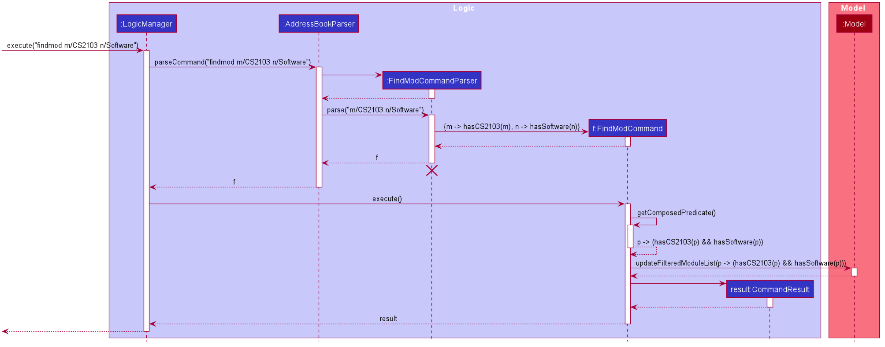
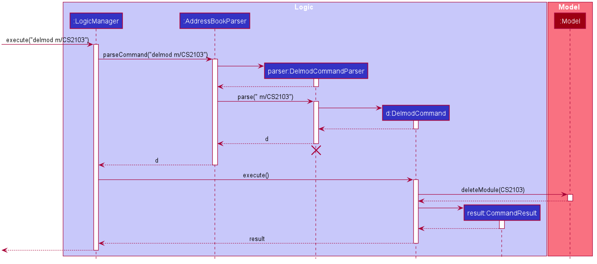
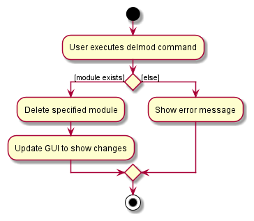
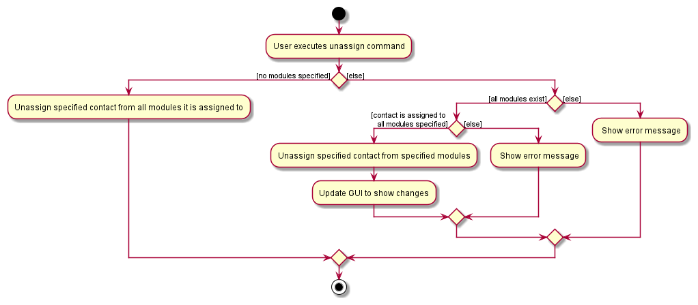
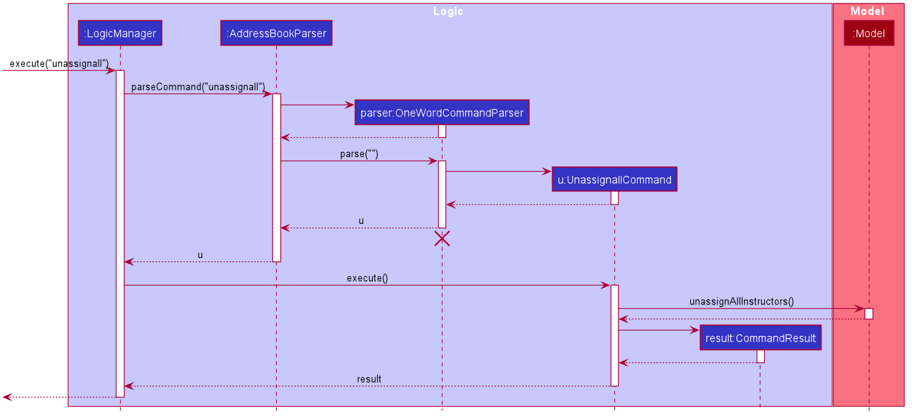
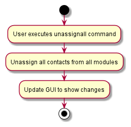
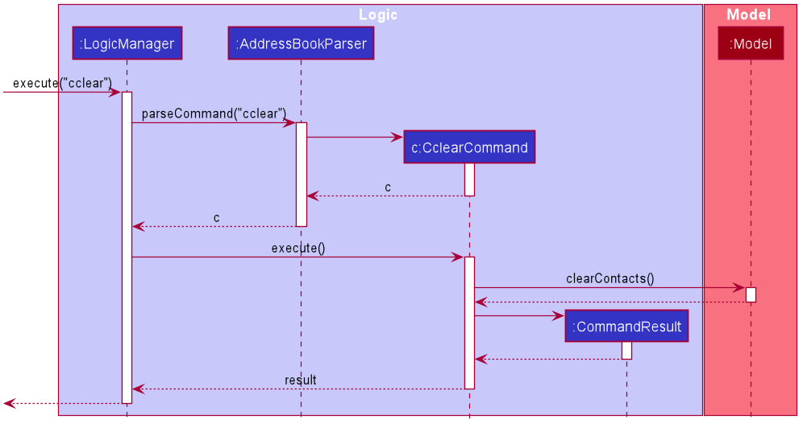

* Table of Contents
{:toc}

--------------------------------------------------------------------------------------------------------------------

## **Setting up, getting started**

Refer to the guide [_Setting up and getting started_](SettingUp.md).

--------------------------------------------------------------------------------------------------------------------

## **Design**

### Architecture

The ***Architecture Diagram*** given above explains the high-level design of the App. Given below is a quick overview of each component.

:bulb: **Tip:** The `.puml` files used to create diagrams in this document can be found in the [diagrams](https://github.com/AY2021S1-CS2103-T14-1/tp/tree/master/docs/diagrams/) folder. Refer to the [_PlantUML Tutorial_ at se-edu/guides](https://se-education.org/guides/tutorials/plantUml.html) to learn how to create and edit diagrams.

**`Main`** has two classes called [`Main`](https://github.com/AY2021S1-CS2103-T14-1/tp/tree/master/src/main/java/seedu/address/Main.java) and [`MainApp`](https://github.com/AY2021S1-CS2103-T14-1/tp/tree/master/src/main/java/seedu/address/MainApp.java). It is responsible for,
* At app launch: Initializes the components in the correct sequence, and connects them up with each other.
* At shut down: Shuts down the components and invokes cleanup methods where necessary.

[**`Commons`**](#common-classes) represents a collection of classes used by multiple other components.

The rest of the App consists of four components.

* [**`UI`**](#ui-component): The UI of the App.
* [**`Logic`**](#logic-component): The command executor.
* [**`Model`**](#model-component): Holds the data of the App in memory.
* [**`Storage`**](#storage-component): Reads data from, and writes data to, the hard disk.

Each of the four components,

* defines its *API* in an `interface` with the same name as the Component.
* exposes its functionality using a concrete `{Component Name}Manager` class (which implements the corresponding API `interface` mentioned in the previous point.

For example, the `Logic` component (see the class diagram given below) defines its API in the `Logic.java` interface and exposes its functionality using the `LogicManager.java` class which implements the `Logic` interface.

**How the architecture components interact with each other**

The *Sequence Diagram* below shows how the components interact with each other for the scenario where the user issues the command `delete 1`.

The sections below give more details of each component.

### UI component

**API** :
[`Ui.java`](https://github.com/AY2021S1-CS2103-T14-1/tp/tree/master/src/main/java/seedu/address/ui/Ui.java)

The UI consists of a `MainWindow` that is made up of parts e.g.`CommandBox`, `ResultDisplay`, `PersonListPanel`, `StatusBarFooter` etc. All these, including the `MainWindow`, inherit from the abstract `UiPart` class.

The `UI` component uses JavaFx UI framework. The layout of these UI parts are defined in matching `.fxml` files that are in the `src/main/resources/view` folder. For example, the layout of the [`MainWindow`](https://github.com/AY2021S1-CS2103-T14-1/tp/tree/master/src/main/java/seedu/address/ui/MainWindow.java) is specified in [`MainWindow.fxml`](https://github.com/AY2021S1-CS2103-T14-1/tp/tree/master/src/main/resources/view/MainWindow.fxml)

The `UI` component,

* Executes user commands using the `Logic` component.
* Listens for changes to `Model` data so that the UI can be updated with the modified data.

### Logic component

**API** :
[`Logic.java`](https://github.com/AY2021S1-CS2103-T14-1/tp/tree/master/src/main/java/seedu/address/logic/Logic.java)

1. `Logic` uses the `AddressBookParser` class to parse the user command.
1. This results in a `Command` object which is executed by the `LogicManager`.
1. The command execution can affect the `Model` (e.g. adding a contact).
1. The result of the command execution is encapsulated as a `CommandResult` object which is passed back to the `Ui`.
1. In addition, the `CommandResult` object can also instruct the `Ui` to perform certain actions, such as displaying help to the user.

Given below is the Sequence Diagram for interactions within the `Logic` component for the `execute("delete 1")` API call.

:information_source: **Note:** The lifeline for `DeleteCommandParser` should end at the destroy marker (X) but due to a limitation of PlantUML, the lifeline reaches the end of diagram.

### Model component

**API** : [`Model.java`](https://github.com/AY2021S1-CS2103-T14-1/tp/tree/master/src/main/java/seedu/address/model/Model.java)

The `Model`,

* stores a `UserPref` object that represents the user’s preferences.
* stores FaculType data.
* exposes an unmodifiable `ObservableList<Person>` and `ObservableList<Module>` that can be 'observed' e.g. the UI
 can be bound to this list so that the UI automatically updates when the data in the list change.
* does not depend on any of the other three components.

:information_source: **Note:** An alternative (arguably, a more OOP) model is given below. It has a `Tag` list in the `AddressBook`, which `Person` references. This allows `AddressBook` to only require one `Tag` object per unique `Tag`, instead of each `Person` needing their own `Tag` object. 

### Storage component

**API** : [`Storage.java`](https://github.com/AY2021S1-CS2103-T14-1/tp/tree/master/src/main/java/seedu/address/storage/Storage.java)

The `Storage` component,
* can save `UserPref` objects in json format and read it back.
* can save FaculType data in json format and read it back.

### Common classes

Classes used by multiple components are in the `seedu.addressbook.commons` package.

--------------------------------------------------------------------------------------------------------------------

## **Implementation**

This section describes some noteworthy details on how certain features are implemented.

### Find by attributes feature

#### Implementation

The find mechanism is facilitated by `FindCommand` and `FindCommandParser`. It allows users to search for contacts by
 their respective attributes. It uses `ModelManager#updateFilteredPersonList(Predicate p)` which is
  exposed in the `Model` interface as `Model#updateFilteredList(Predicate p)`. The method updates the
  current person list and filters it according to the given predicate which will then be shown accordingly in the GUI.

The following sequence diagram shows how the find by attributes operation works:

:information_source: **Note:** The lifeline for `FindCommandParser` should
 end at the destroy marker (X) but due to a limitation of PlantUML, the lifeline reaches the end of diagram.

The following activity diagram summarizes what happens when a user executes a find command:

#### Design consideration:

##### Aspect: How find executes

* **Alternative 1 (current choice):** AND Searching from multiple attributes and keywords.
  * Pros: Provides the ability to narrow down search results by adding more keywords and attributes.
  * Cons: Unable to search for multiple persons with different attributes.

* **Alternative 2:** AND Searching across attributes, OR Searching between keywords.
  * Pros: Provides the ability to narrow down search results by adding more attributes as well as expanding the search
   scope by adding more keywords (i.e: more flexible).
  * Cons: A possible source of confusion as they use different searching methods.

Both options are equally feasible. However, Alternative 1 was chosen to avoid confusion for prospective users.

### Find module by module attributes feature

#### Implementation

The find module mechanism is facilitated by `FindModCommand` and `FindModCommandParser`. It allows users to search for modules based on their respective attributes which are the module code, module name and instructors teaching the module.
It uses `ModelManager#updateFilteredModuleList(Predicate p)` which is exposed in the Model interface as `Model#updateFilteredModuleList(Predicate p)`.
The method updates the current module list and filters it according to the given predicate which will then be reflected accordingly in the GUI.

The following sequence diagram shows how the find module by module attributes operation works:

The following activity diagram summarizes what happens when a user executes a findmod command:

#### Design consideration:

##### Aspect: How findmod executes

* **Alternative 1 (current choice):** AND searching from multiple attributes and OR searching between keywords for module name and instructor attributes. Module code attribute only allows single keywords.
  * Pros : Provides the ability to narrow down the search results by adding more attributes while also allowing more flexible search within the attributes. Single keyword for module code attribute allows for more focused module code searches.
  * Cons : Unable to search for multiple modules with different module attributes and unable to search for multiple modules with different module codes.

* **Alternative 2:** And searching across attributes and disallow multiple keyword search across all attributes.
  * Pros : Provides the ability for a very focused module search.
  * Cons : Attributes like instructor name and module name might be difficult to remember, and might be difficult to find with just one keyword.

### Deleting Module feature

#### Implementation

The delete module mechanism is facilitated by the `DelmodCommand` and the `DelmodCommandParser`.
It uses an operation `AddressBook#removeModule()` which is exposed in the `Model` interface as `Model#deleteModule()`.
Then, the `removeModuleWithCode()` operation is called in `UniqueModuleList`. `UniqueModuleList#removeModuleWithCode()` will remove the module with the specified code
from the module list.

Given below is the example usage scenario and how the delete module mecahnism behaves at each step.

Step 1. The user launches the application. Facultype is initialized with the module `CS2103` in the addressbook.

Step 2. The user executes the command `delmod m/CS2103` to delete the module with the module code CS2103 in the addressbook.

Step 3. The `delmod` command then calls `Model#deleteModule()` after checking for the existence of the specified module.

Step 4. The Module with the specified module code, will be deleted from the `UniqueModuleList` in the addressbook.

The following sequence diagram shows how the deleting of the module works:

The following activity diagram summarizes what happens when a user executes a delmod command:

#### Design consideration:

##### Aspect: What the delmod command deletes by
* **Alternative 1 (current choice):** Deletes a module based on the module code.
  * Pros : More intuitive to the Dean to delete by the module code.
  * Cons : Would be more troublesome to look for the module should the Dean forget the module code.

* **Alternative 2:** Deletes a module based on the index of the module list.
  * Pros : Dean does not have to memorise all the module code, can simply delete based on what is shown in the module list.
  * Cons : Less intuitive.

####  Deleting a module from the module list

  a. Prerequisites:  Delete a module from the module list using the `delmod` command. There are only 3 modules with module codes `CS2103`, `CS2100`, `CS1010S` in FaculType.

  b. Test case: `delmod m/CS2103`
  Expected: Module with module code `CS2103` would be deleted from the module list.

  c. Test case: `delmod m/CS1101S`
  Expected: No module is deleted from the module list since `CS1101S` is not a module that exists in the module list. Error details shown in the status message. Status bar remains the same.

  d. Test case: `delmod m/CS2103 m/CS2100`
  Expected: No module is deleted from the module list because `delmod` does not allow for multiple deletions. Error details shown in the status message. Status bar remains the same.

  { more test cases ... }

### Assign feature

#### Implementation

The assign feature is facilitated by `AssignCommand` and `AssignCommandParser`.
It uses an operation `AddressBook#assignInstructor()` which is exposed in the `Model` interface as `Model#assignInstructor()`.
Then, the `assignInstructor()` operation is called in both `UniqueModuleList` and `Module`. `Module#assignInstructor()` will add the instructor to the module's set of instructors.

#### Design consideration:

##### Aspect: How to store assignments
* **Alternative 1 (current choice):** A module has a set of instructors assigned to it.
  * Pros: More efficient to list the instructors of a certain module.
  * Cons: Less efficient to list the modules of a certain instructor.

* **Alternative 2:** An instructor has a set of modules they are assigned to.
  * Pros: More efficient to list the modules of a certain instructor.
  * Cons: Less efficient to list the instructors of a certain module.

Both are equally viable options but Alternative 1 was chosen so `Person` would not have to be redesigned or have too many fields.

### Unassign feature

The assign feature is facilitated by `UnassignCommand` and `UnassignCommandParser`.
It uses an operation `AddressBook#unassignInstructor()` which is exposed in the `Model` interface as `Model#unassignInstructor()`.
Then, the `unassignInstructor()` operation is called in both `UniqueModuleList` and `Module`. `Module#unassignInstructor()` will remove the instructor from the module's set of instructors.

The following sequence diagram shows how the unassign operation works:

The following activity diagram summarizes what happens when a user executes a unassign command:

#### Unassigning a certain instructor from one or more modules
a. Prerequisites : Unassign all instructors from all modules using the `unassignall` command. There are only 3 modules with module codes `CS2103`, `CS2100`, `CS1010S` in FaculType.
Contact on index `1` is an instructor of module with module code `CS2103` and `CS2100`, while contact on index `2` is an instructor of module with module code `CS2100` and `CS1010S`.

b. Test case : `unassign 1 m/CS2103 m/CS2100` 
Expected : First contact is unassigned from both CS2103 and CS2100 modules. First contact is no longer an instructor of CS2103 nor CS2100 module.

c. Test case : `unassign 2 m/CS2103 m/CS2100` 
Expected : No contact is unassigned from any modules because instructor on index `2` is not an instructor of module `CS2103`.

d. Test case : `unassign 0 m/CS1010S` 
Expected : No contact is unassigned from any modules. Error details shown in the status message. Status bar remains the same.

e. Test case : `unassign 1 m/CS3230` 
Expected : No contact is unassigned from any modules. Error details shown in the status message. Status bar remains the same.

f. Other incorrect unassign commands to try : `unassign`, `unassign x m/y` (where x is larger that the list size or is not an instructor of module y), `unassign a m/b` (where b does not exist in FaculType) 
Expected : Similar to previous.

{ more test cases ... }

### Unassignall feature

The assign feature is facilitated by `UnassignallCommand` and `UnassignallCommandParser`.
It uses an operation `AddressBook#unassignAllInstructors()` which is exposed in the `Model` interface as `Model#unassignAllInstructors()`.
Then, the `unassignAllInstructors()` operation is called in both `UniqueModuleList` and `Module`. `Module#unassignAllInstructors()` will remove all instructors from all modules' set of instructors.

The following sequence diagram shows how the unassignall operation works:

The following activity diagram summarizes what happens when a user executes a unassignall command:

#### Design consideration:

##### Aspect: How unassignall executes

* **Alternative 1 (current choice):** Unassigns all instructors from all modules.
 * Pros : More efficient to unassign all instructors from all modules.
 * Cons : Less efficient to unassign a certain instructor from all modules he/she teaches.

* **Alternative 2:** Unassign a certain instructor from all modules he/she teaches.
 * Pros : More efficient to unassign a certain instructor from all modules he/she teaches.
 * Cons : Less efficient to unassign all instructors from all modules.

### Clear all contacts feature

#### Implementation

It implements the following operations:
* `AddressBook#clearContacts()` — Clear all contacts from the list.

These operations are exposed in the `Model` interface as `Model#clearContacts()` and `UniquePersonList` class as `UniquePersonList#clearAll()`

The following sequence diagram shows how the cclear operation works:

Clearing all contacts from the contact list

a. Prerequisites : Clear all contacts from contact list using `cclear` There are 3 contacts with names `Andre Taulani`, `Bayu Skak`, `Cak Lontong` in FaculType.

b. Test case : `cclear`  
Expected : Success message saying "All contacts deleted"

c. Test case : `cclear` on an empty contact list  
Expected : Error message saying "Contact list is already empty".

{ more test cases ... }

### Clear all modules feature

#### Implementation

It implements the following operations:
* `AddressBook#clearMod()` — Clear all modules from the list.

These operations are exposed in the `Model` interface as `Model#clearMod()` and `UniqueModuleList` class as `UniqueModuleList#clearAll()`

The following sequence diagram shows how the mclear operation works:

Clearing all modules from the module list

a. Prerequisites : Clear all modules from module list using `mclear` There are 3 modules with module codes `CS2100`, `CS2101`, `CS2102` in FaculType.

b. Test case : `mclear`  
Expected : Success message saying "All modules deleted"

c. Test case : `mclear` on an empty module list  
Expected : Error message saying "Module list is already empty".

{ more test cases ... }

### \[Proposed\] Switch feature

#### Proposed Implementation

The switch feature is facilitated by `AddressBook#switchActiveSemester()`.
The `AddressBook` will store three module lists, one for Semester 1, one for Semester 2, and one to reference the active semester.
All operations on `UniqueModuleList` will be done on the active semester. `AddressBook#switchActiveSemester()` toggles the active semester between Semester 1 and Semester 2.

#### Design consideration:

##### Aspect: Viewing a certain semester
* **Alternative 1 (current choice):** There are two module lists and active semester references one of them.
  * Pros: Less code to change, more difficult to test.
  * Cons: Can only manage the modules in the active semester.

* **Alternative 2:** There is only one module list and there is a filter to only show modules of a particular semester.
  * Pros: More efficient to list the modules of a certain instructor.
  * Cons: Need to add semester field to modules and commands, will have two copies of the same module if held in both semesters, more code to change.

### \[Proposed\] Undo/redo feature

#### Proposed Implementation

The proposed undo/redo mechanism is facilitated by `VersionedAddressBook`. It extends `AddressBook` with an undo/redo history, stored internally as an `addressBookStateList` and `currentStatePointer`. Additionally, it implements the following operations:

* `VersionedAddressBook#commit()` — Saves the current FaculType state in its history.
* `VersionedAddressBook#undo()` — Restores the previous FaculType state from its history.
* `VersionedAddressBook#redo()` — Restores a previously undone FaculType state from its history.

These operations are exposed in the `Model` interface as `Model#commitAddressBook()`, `Model#undoAddressBook()` and `Model#redoAddressBook()` respectively.

Given below is an example usage scenario and how the undo/redo mechanism behaves at each step.

Step 1. The user launches the application for the first time. The `VersionedAddressBook` will be initialized with the initial FaculType state, and the `currentStatePointer` pointing to that single FaculType state.

Step 2. The user executes `delete 5` command to delete the 5th contact in FaculType. The `delete` command calls
 `Model#commitAddressBook()`, causing the modified state of FaculType after the `delete 5` command executes to be saved in the `addressBookStateList`, and the `currentStatePointer` is shifted to the newly inserted FaculType state.

Step 3. The user executes `add n/David …​` to add a new contact. The `add` command also calls `Model#commitAddressBook
()`, causing another modified FaculType state to be saved into the `addressBookStateList`.

:information_source: **Note:** If a command fails its execution, it will not call `Model#commitAddressBook()`, so the FaculType state will not be saved into the `addressBookStateList`.

Step 4. The user now decides that adding the contact was a mistake, and decides to undo that action by executing the
 `undo` command. The `undo` command will call `Model#undoAddressBook()`, which will shift the `currentStatePointer` once to the left, pointing it to the previous FaculType state, and restores FaculType to that state.

:information_source: **Note:** If the `currentStatePointer` is at index 0, pointing to the initial AddressBook state, then there are no previous AddressBook states to restore. The `undo` command uses `Model#canUndoAddressBook()` to check if this is the case. If so, it will return an error to the user rather
than attempting to perform the undo.

The following sequence diagram shows how the undo operation works:

:information_source: **Note:** The lifeline for `UndoCommand` should end at the destroy marker (X) but due to a limitation of PlantUML, the lifeline reaches the end of diagram.

The `redo` command does the opposite — it calls `Model#redoAddressBook()`, which shifts the `currentStatePointer` once to the right, pointing to the previously undone state, and restores FaculType to that state.

:information_source: **Note:** If the `currentStatePointer` is at index `addressBookStateList.size() - 1`, pointing to the latest FaculType state, then there are no undone AddressBook states to restore. The `redo` command uses `Model#canRedoAddressBook()` to check if this is the case. If so, it will return an error to the user rather than attempting to perform the redo.

Step 5. The user then decides to execute the command `list`. Commands that do not modify FaculType, such as `list`, will usually not call `Model#commitAddressBook()`, `Model#undoAddressBook()` or `Model#redoAddressBook()`. Thus, the `addressBookStateList` remains unchanged.

Step 6. The user executes `clear`, which calls `Model#commitAddressBook()`. Since the `currentStatePointer` is not pointing at the end of the `addressBookStateList`, all FaculType states after the `currentStatePointer` will be purged. Reason: It no longer makes sense to redo the `add n/David …​` command. This is the behavior that most modern desktop applications follow.

The following activity diagram summarizes what happens when a user executes a new command:

#### Design consideration:

##### Aspect: How undo & redo executes

* **Alternative 1 (current choice):** Saves the entire FaculType data.
  * Pros: Easy to implement.
  * Cons: May have performance issues in terms of memory usage.

* **Alternative 2:** Individual command knows how to undo/redo by
  itself.
  * Pros: Will use less memory (e.g. for `delete`, just save the contact being deleted).
  * Cons: We must ensure that the implementation of each individual command are correct.

_{more aspects and alternatives to be added}_

### \[Proposed\] Data archiving

_{Explain here how the data archiving feature will be implemented}_

--------------------------------------------------------------------------------------------------------------------

## **Documentation, logging, testing, configuration, dev-ops**

* [Documentation guide](Documentation.md)
* [Testing guide](Testing.md)
* [Logging guide](Logging.md)
* [Configuration guide](Configuration.md)
* [DevOps guide](DevOps.md)

--------------------------------------------------------------------------------------------------------------------

## **Appendix: Requirements**

### Product scope

**Target user profile**:

* works as a faculty leader
* has a need to manage a significant number of faculty members
* has a need to manage a significant number of modules
* has a need to manage assignments of modules to faculty members
* prefer desktop apps over other types
* can type fast
* prefers typing to mouse interactions
* is reasonably comfortable using CLI apps

**Value proposition**: manage faculty members and modules faster than a typical mouse/GUI driven app

### User stories

Priorities: High (must have) - `* * *`, Medium (nice to have) - `* *`, Low (unlikely to have) - `*`

| Priority | As a …​                                 | I want to …​                   | So that I can…​                                                        |
| -------- | ------------------------| -----------------------------------|--------------------------------------------------------------------------------------|
| `* * *`  | new user                | see usage instructions             | refer to instructions when I forget how to use the App                               |
| `* * *`  | user                    | add a new contact                  |                                                                                      |
| `* * *`  | user                    | delete a contact                   | remove entries that I no longer need                                                 |
| `* * *`  | user                    | find a contact by attributes       | locate details of contacts without having to go through the entire list              |
| `* * *`  | forgetful user          | add remarks to contacts            | remember certain details about them                                                  | 
| `* * *`  | faculty leader          | store a contact's office           | keep track of where to find them                                                     |
| `* * *`  | faculty leader          | store a contact's department       | keep track of their respective field                                                 |
| `* * *`  | faculty leader          | edit a contact's office            | keep the data up to date                                                             |
| `* * *`  | faculty leader          | edit a contact's department        | keep the data up to date                                                             |
| `* * *`  | faculty leader          | add a new module                   |                                                                                      |
| `* * *`  | faculty leader          | delete a module                    | remove modules no longer offered                                                     |
| `* * *`  | faculty leader          | find modules by their code         |                                                                                      |
| `* * *`  | faculty leader          | find modules by their name            |                                                                                   |
| `* * *`  | faculty leader          | find modules by the instructor's name |                                                                                   |
| `* * *`  | faculty leader          | assign instructors to various modules     | keep a record of all the modules they teach                                   |
| `* * *`  | faculty leader          | unassign instructors from various modules | update the record of instructors when necessary                               |
| `* * *`  | faculty leader          | unassign all instructors from all modules | update the record of instructors when there are syllabus restructuring        |
| `* * *`  | user                    | clear all contacts                  |                                                                                     |
| `* * *`  | faculty leader          | clear all modules                   | discard all previous semester's information                                         |
| `* * *`  | faculty leader          | be able to switch semester easily   | shift semester without having to reassign all instructors                           | 

*{More to be added}*

### Use cases

(For all use cases below, the **System** is the `FaculType` and the **Actor** is the `user`, unless specified otherwise)

**Use case: Add a contact**

**MSS**

1.  User requests to add a specific contact in the list
2.  FaculType adds the contact

    Use case ends.

**Extensions**

* 1a. The attributes are in an invalid format.

    * 1a1. FaculType shows an error message.

      Use case resumes at step 1.

* 1b. The contact to be added already exists.

    * 1b1. FaculType shows an error message.

      Use case resumes at step 1.

**Use case: Delete a contact**

**MSS**

1.  User requests to list contacts
2.  FaculType shows a list of contacts
3.  User requests to delete a specific contact in the list
4.  FaculType deletes the contact

    Use case ends.

**Extensions**

* 2a. The list is empty.

  Use case ends.

* 3a. The given index is invalid.

    * 3a1. FaculType shows an error message.

      Use case resumes at step 2.

**Use case: Edit a contact**

**MSS**

1.  User requests to list contacts
2.  FaculType shows a list of contacts
3.  User requests to edit a specific contact in the list
4.  FaculType edits the contact

    Use case ends.

**Extensions**

*   2a. The list is empty.

    Use case ends.

*   3a. The given index is invalid.

    * 3a1. FaculType shows an error message.
    
      Use case resumes at step 2.
      
*   3b. The attributes to be edited are invalid.

    * 3b1. FaculType shows an error message.
    
      Use case resumes at step 2.
 
**Use case: Find a contact**

**MSS**

1.  User requests to list contacts
2.  FaculType shows a list of contacts
3.  User requests to find a specific contact
4.  FaculType shows the contact(s)

    Use case ends.

**Extensions**

*  2a. The list is empty.

   Use case ends.
 
**Use case: Add or update a remark**

**MSS**

1.  User requests to list contacts
2.  FaculType shows a list of contacts
3.  User requests to add/edit a specific contact's remark in the list
4.  FaculType adds/edits the contact's remark

    Use case ends.

**Extensions**

*   2a. The list is empty.

    Use case ends.

*   3a. The given index is invalid.

    * 3a1. FaculType shows an error message.

      Use case resumes at step 2.

**Use case: Add a module**

**MSS**

1.  User requests to add a module to the module list
2.  FaculType adds the module

    Use case ends.

**Extensions**

*   1a. The module code already exists.

    * 1a1. FaculType shows an error message.
 
      Use case resumes at step 1.

**Use case: Delete a module**

**MSS**

1.  FaculType shows a list of modules
2.  User requests to delete a module
3.  FaculType deletes the module

    Use case ends.

**Extensions**

*   1a. The module list is empty.

    Use case ends.

*   2a. The given module code does not exist.

    * 2a1. FaculType shows an error message.

    Use case resumes at step 1.

**Use case: Find a module**

**MSS**

1.  User requests to list all modules
2.  FaculType shows a list of all modules
3.  User requests to find a specific module
4.  FaculType shows the module(s)

   Use case ends.

**Extensions**

*  2a. The module list is empty.

   Use case ends.

**Use case: Assign a contact to a module**

**MSS**

1.  User requests to list contacts
2.  FaculType shows the list of contacts
3.  User requests to list modules
4.  FaculType shows the list of modules
5.  User requests to assign a contact to a module
6.  FaculType assigns the contact to the module

    Use case ends.

**Extensions**

*   2a. The contact list is empty.

    Use case ends.

*   4a. The module list is empty.

    Use case ends.

*   5a. The given contact does not exist.

    *   5a1. FaculType shows an error message.

    Use case resumes at step 4.

*   5b. The given module does not exist.

    * 5b2. FaculType shows an error message.

    Use case resumes at step 4.

### Non-Functional Requirements

1.  Should work on any _mainstream OS_ as long as it has Java `11` or above installed.
2.  Should be able to hold up to 1000 contacts without a noticeable sluggishness in performance for typical usage.
3.  A user with above average typing speed for regular English text (i.e. not code, not system admin commands) should be able to accomplish most of the tasks faster using commands than using the mouse.
4. Should be usable by a novice who has never used a contact management system/command line application before.
5. Should adhere to the schedule specified in the CS2103 website.
6. Not required to support contacting the faculty members.
7. Not required to handle printing of faculty member/module data.
8. Not required to connect to any backend system/DBMS.
9. Not required to support multiple users on a single device.
10. Not required to support any language other than English.
11. Should be able to work without users having Gradle/JavaFX installed beforehand.
12. Each time a user opens the application, the user should be able to view the latest version of the data (new/updated data should be there and deleted data should no longer exist).

### Glossary

* **Mainstream OS**: Windows, Linux, Unix, OS-X
* **Private contact detail**: A contact detail that is not meant to be shared with others
* **Attribute**: A piece of information associated to a contact, i.e. name, contact, number, email, department, office, remark, tag(s)
* **Contact**: A member of a faculty
* **Module**: A course held in a college or university. A module can be assigned to a contact
* **Assignment**: A module handled by a contact. Assignment links a contact with a module
* **Remark**: A short description of a contact. Remark is an optional attribute
* **Tag**: An optional one-word identifier of a contact. A contact can have multiple tags
* **Instructor** : A faculty member who teaches a particular module

--------------------------------------------------------------------------------------------------------------------

## **Appendix: Instructions for manual testing**

Given below are instructions to test the app manually.

:information_source: **Note:** These instructions only provide a starting point for testers to work on;
testers are expected to do more *exploratory* testing.

### Launch and shutdown

1. Initial launch

   1. Download the jar file and copy into an empty folder

   1. Double-click the jar file Expected: Shows the GUI with a set of sample contacts. The window size may not be optimum.

1. Saving window preferences

   1. Resize the window to an optimum size. Move the window to a different location. Close the window.

   1. Re-launch the app by double-clicking the jar file. 
       Expected: The most recent window size and location is retained.

1. _{ more test cases …​ }_

### Deleting a contact

1. Deleting a contact while all contacts are being shown

   1. Prerequisites: List all contacts using the `list` command. Multiple contacts in the list.

   1. Test case: `delete 1` 
      Expected: First contact is deleted from the list. Details of the deleted contact shown in the status message. Timestamp in the status bar is updated.

   1. Test case: `delete 0` 
      Expected: No contact is deleted. Error details shown in the status message. Status bar remains the same.

   1. Other incorrect delete commands to try: `delete`, `delete x`, `...` (where x is larger than the list size) 
      Expected: Similar to previous.

1. _{ more test cases …​ }_

### Finding a contact

1. Finding a contact while all contacts are being shown

   1. Prerequisites: List all contacts using the `list` command. Multiple contacts in the list.

   1. Test case: `find n/Alice d/Math` 
      Expected: All contacts that has "Alice" in their name, and "Math" in their department is shown.
      . Timestamp in the status bar is updated.

   1. Test case: `find n/` 
      Expected: No contacts filtered. Error details shown in the status message. Status bar remains the same.

   1. Other incorrect find commands to try: `find p/abcdef`, `find`, `find Alice`, `...`
      Expected: Similar to previous.

1. _{ more test cases …​ }_

### Saving data

1. Dealing with missing/corrupted data files

   1. _{explain how to simulate a missing/corrupted file, and the expected behavior}_

1. _{ more test cases …​ }_

